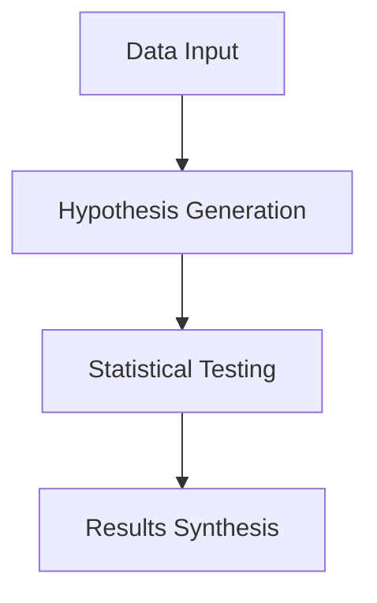

# Hypothesis Forge

An AI-powered tool that automatically generates and tests hypotheses on data, providing actionable insights through statistical analysis.

## Overview

Hypothesis Forge analyzes your data and generates hypotheses that you can test. It then automatically tests them and provides detailed results with statistical significance.



## Features

- **Automated Hypothesis Generation**: Creates relevant hypotheses based on data context and audience
- **Statistical Testing**:
  - Automatic selection of appropriate statistical tests
  - Support for t-tests, chi-square, correlation significance tests
  - P-value calculation and interpretation
- **Interactive Interface**:
  - Real-time hypothesis testing
  - Dynamic results visualization
  - Dark mode support
  - Mobile-responsive design
  - "Run All" feature to test multiple hypotheses at once
  - Result synthesis for actionable insights
- **Multiple Data Formats**:
  - CSV files
  - SQLite databases (.sqlite3, .sqlite, .db, .s3db, .sl3)
  - Support for various data types (numeric, categorical, temporal)

## Usage

1. Select a dataset from the available demos
2. The application will:
   - Load and analyze the data
   - Generate relevant hypotheses
   - Display hypotheses with test buttons
3. For each hypothesis:
   - Click "Test" to run statistical analysis
   - View detailed results and interpretation
   - See p-values and statistical significance
4. After testing hypotheses:
   - Click "Synthesize" to get actionable insights
   - Use "Reset" to clear results and start over

## Setup

### Prerequisites

- Modern web browser with JavaScript enabled
- OpenAI API key or equivalent

### Local Setup

1. Clone this repository:

```bash
git clone https://github.com/sanand0/hypoforge.git
cd hypoforge
```

2. Serve the files using a static server:

```bash
python -m http.server 8000
```

3. Open `http://localhost:8000` in your browser
4. Log in with an OpenAI API key or equivalent

## License

[MIT](LICENSE)
